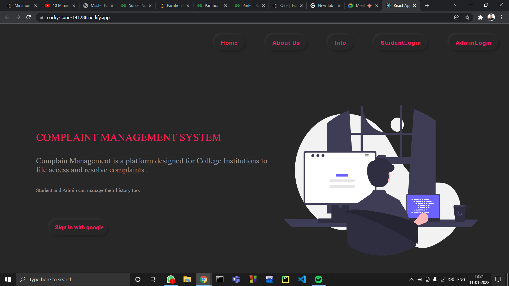
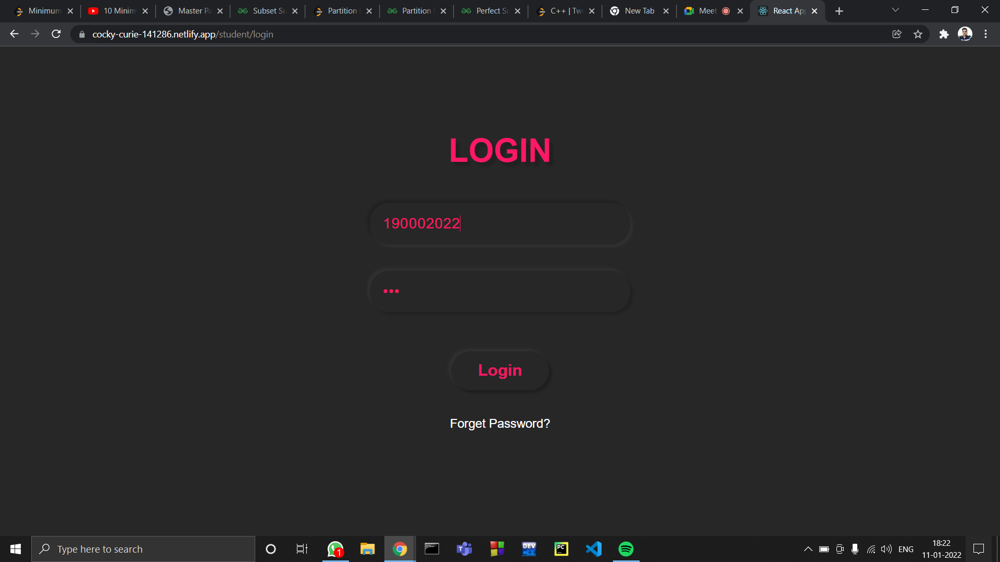

# College-Complain-Management
It becomes very difficult for college Students to file complain and also it become difficult for admin to resolve the complain via mail. Because Searching complain on mail
and resolving and managing history of complains So that it will be useful for future students to see all the past complains and its resolution. We have tried to solve this problem to a extent via using this our MERN project.   
It is a platform for a college institution to manage the complains of the student on a single platform in better way. The process is very simple. 
# Let's take Student First.
If you are student then you can login via your rollno and password.
<image>

Then student can see the below screen after successful login.
 
<image>
  
Now student can see the all the complains filed by other students and can click on details to get full detail.
<image>
  
  
In History student can see his/her past complains where he/she can see the details and can delete as well.
<Image>
  
  
  
 In New Complain student can file the complains related to different department and complain will be automatically forwared to respective admin.
 <Image> 
   
# Let's take Admin.
If you are Admin then you can login via your department and password.
<image>

Then Admin can see the below screen after successful login.

<image>

Now Admin can see the all the complains filed by other students and can click on resolve to get full detail and resolve it and it will be forwarded to students automatically.
<image>

In History Admin can see his/her past Resolved complains where he/she can see the details and can delete as well.
<Image>

We have hosted our website on [Frontend Netlify and Backend Heroku ](https://cocky-curie-141286.netlify.app/)
Please Open it in PC as it is not mobile responsive.
If you want to login as Student write rollno:190002022 and password:123
If you want to login as Student write department:Sport and password:123
  
#### If you find any errors, feel free to raise an issue :)  
  
## Tech Stuff Used
HTML5, CSS3, React js    
NodeJs    
MongoDB 
Auhthentication using jwt tokens.  
## Run This Webapp On Your Local Device
Install NodeJS    
Clone the repository  
Make account on MongoDB Atlas and make a collection and the link to CONNECTION_URL in index.js of the server. 
   
In CMD, navigate to Keeper-app folder and run   
`$ npm install`   

Then in CMD, run this code  
`$ npm start ` on both server side as well as client side by opening two terminals.
   
In your browser, navigate to this [URL](http://localhost:3000)  
Login Page would be visible  
Now you can register and Login and ready to use the web app. 
   
## Website Screeenshots    
   
      
    
   
   

